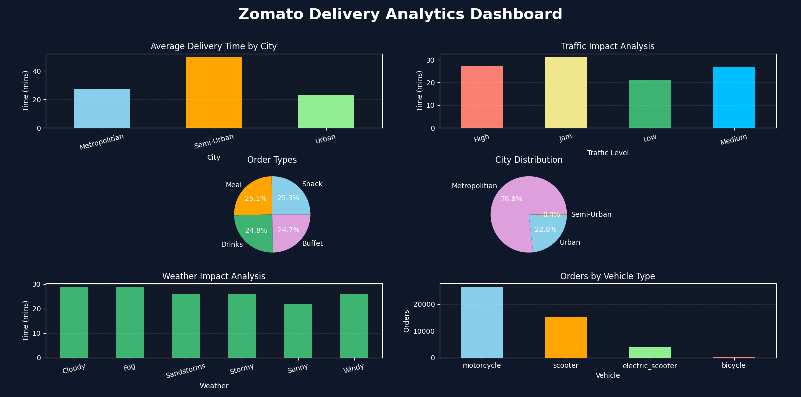

# Zomato Delivery Analytics Dashboard 🍔📊

A data analytics project built using **Python, Pandas, and Matplotlib** to analyze Zomato delivery operations and visualize business insights through interactive charts and a custom dashboard.

---

# 📌 Project Overview

This project focuses on analyzing delivery data such as:

* Delivery time by city
* Traffic impact on deliveries
* Weather impact analysis
* Vehicle usage analysis
* Order type distribution
* City distribution analysis

The goal of this project is to practice:

* Data Analysis
* Data Visualization
* Dashboard Design
* Python Libraries
* Business Insight Generation

---

# 🛠️ Technologies Used

* Python
* Pandas
* Matplotlib

---

# 📂 Project Structure

```text id="s8n2vr"
ZOMATO-DELIVERY-ANALYTICS
│
├── Dataset
│   └── Zomato Dataset.csv
│
├── Python Files
│   ├── dashboard.py
│   ├── delivery_time_by_city.py
│   ├── city_distribution.py
│   ├── order_analysis.py
│   ├── traffic_analysis.py
│   ├── vehicle_analysis.py
│   └── weather_analysis.py
│
├── Screenshots
│   ├── dashboard_output.png
│   ├── average-delivery-time-by-city.png
│   ├── city-distribution.png
│   ├── order-type-distribution.png
│   ├── orders-by-vehicle-type.png
│   ├── traffic-impact-analysis.png
│   └── weather-impact-analysis.png
│
├── requirements.txt
│
└── README.md
```

---

# 📊 Dashboard Features

## 1. Delivery Time by City

Analyzes average delivery time across different city categories.

## 2. Traffic Impact Analysis

Shows how traffic conditions affect delivery performance.

## 3. Weather Impact Analysis

Analyzes delivery time under different weather conditions.

## 4. Vehicle Usage Analysis

Displays the most commonly used delivery vehicles.

## 5. Order Type Distribution

Visualizes distribution of different order categories.

## 6. City Distribution

Shows order distribution across city types.

---

# 📷 Dashboard Preview

## Main Dashboard



---

# 🚀 How to Run the Project

## 1. Install Required Libraries

```bash id="n4x8qa"
pip install pandas matplotlib
```

---

## 2. Run Dashboard File

```bash id="f7m2kp"
python dashboard.py
```

---

# 📈 Key Insights

* Traffic congestion increased delivery time significantly.
* Metropolitan cities had the highest order distribution.
* Motorcycles were the most used delivery vehicles.
* Weather conditions slightly affected delivery efficiency.
* Different order types showed balanced distribution.

---

# 🎯 Learning Outcomes

Through this project, I learned:

* Data cleaning using Pandas
* GroupBy operations and aggregation
* Data visualization using Matplotlib
* Dashboard layout creation
* Dark-themed dashboard styling
* Business insight extraction from datasets

---

# 👨‍💻 Author

**Moin Ahmed**

🔗 LinkedIn:  
https://www.linkedin.com/in/moin-ahmed27/

🔗 GitHub:  
https://github.com/Moin-27

🌐 Portfolio:  
https://moin-27.github.io/Portfolio/

---

# ⭐ If you liked this project

Give it a star on GitHub ⭐
